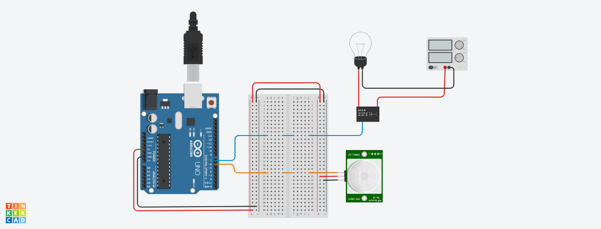

# Lâmpada Inteligente

Sistema para controle liga/desliga de uma lampada utilizando sensor de Movimento PIR para arduino.

**Equipe:**
- Denis Lopes - denismoura@a.recife.ifpe.edu.br
- Hugo César - hcdl@a.recife.ifpe.edu.br
- Pedro Vila Nova - phpvn@a.recife.ifpe.edu.br 

## O Projeto

### Componentes

Para desenvolver o protótipo da lâmpada inteligente, utilizou-se os seguintes materiais:

- 01 Arduino Uno
- 01 Móulo Sensor de Movimento PIR
- 01 Módulo Relé 5v - 1 canal
- 01 Lampanda de Led 10w - 110v/220v
- 01 Mini protoboard
- 01 Bocal Bivolt e27 - Porcelana
- 01 PushButton
- Jumpers
- Plugue Macho - 250v 10a

### Circuito

